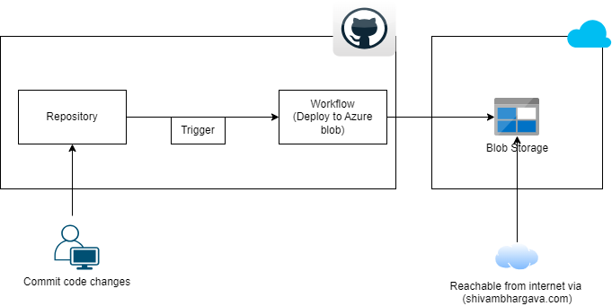

# my-resume
This project is about my resume having below details

## Profile Info

1. Certifications
2. Skills
3. Work Experience
4. Contact Details

## Architecture Diagram

## Setup CI/CD

1. Create Service Princpal in Azure and Obtain Secrets

`
az login
az ad sp create-for-rbac --name shivamresume --role contributor --scopes /subscriptions/subscriptionid/resourceGroups/rg-name
`
2. Save return clientid and clientsecret in Github secrets (Go to Project settings of the repo,and find 'secret and variable' menu and then add  repository secrets) and add entire json returned in above step

3. Then follow reference links and update azure resource name and git secret name

4. Commit to master and observe the workflow.Done and dusted

Reference link
`
https://learn.microsoft.com/en-us/azure/storage/blobs/storage-blobs-static-site-github-actions?tabs=userlevel
`

## TODO

1. Integrate feature like (Total Profile Visitors info, Download CV option, etc..) (possible next month)
2. Update pipeline/architecture diagram
(possible next month)
3. Make content pluggable from SQL DB in future